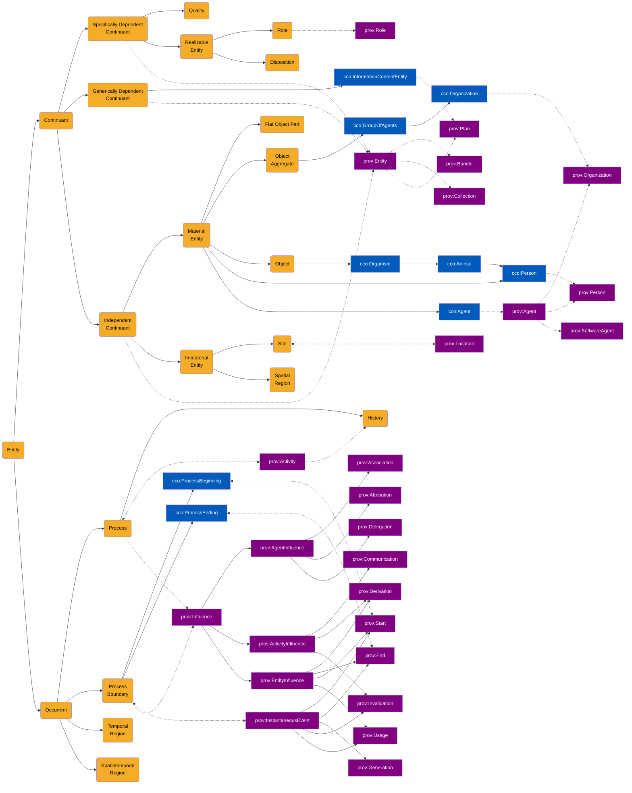
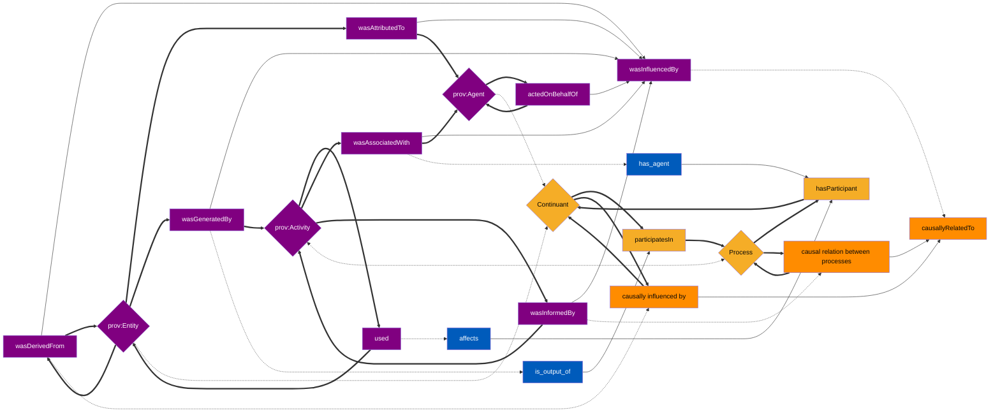

# Class Hierarchy Mapping

```mermaid
graph LR

    A(Entity):::BFO --> B(Continuant)
    B(Continuant):::BFO --> D(Specifically Dependent<br> Continuant)
    B(Continuant) --> E(Generically Dependent<br> Continuant):::BFO
    B(Continuant) --> F(Independent<br> Continuant)
    F(Independent<br> Continuant):::BFO --> G(Material Entity)
    F(Independent<br> Continuant) --> H(Immaterial<br> Entity)
    D(Specifically Dependent<br> Continuant):::BFO --> I(Quality):::BFO
    D(Specifically Dependent<br> Continuant) --> J(Realizable<br> Entity):::BFO
    %%% I(Quality):::BFO --> K(Relational<br> Quality):::BFO
    J(Realizable<br> Entity):::BFO --> L(Role):::BFO
    J(Realizable<br> Entity) --> M(Disposition):::BFO
    %%% M(Disposition) --> N(Function):::BFO
    H(Immaterial<br> Entity):::BFO --> O(Site):::BFO
    H(Immaterial<br> Entity) --> P(Spatial<br> Region):::BFO
    %%% H(Immaterial<br> Entity) --> Q(Continuant Fiat<br> Boundary):::BFO

    G(Material<br> Entity):::BFO --> X(Fiat Object Part):::BFO
    G(Material<br> Entity):::BFO --> Y(Object<br> Aggregate):::BFO
    G(Material<br> Entity):::BFO --> Z(Object):::BFO
    A(Entity):::BFO --> C(Occurrent):::BFO
    C(Occurrent):::BFO --> AA(Process):::BFO
    C(Occurrent) --> AB(Process<br> Boundary):::BFO
    C(Occurrent) --> AC(Temporal<br> Region):::BFO
    C(Occurrent) --> AD(Spatiotemporal<br> Region):::BFO
    AA(Process):::BFO --> AE(History):::BFO
    %%% AC(Temporal<br> Region):::BFO --> AF(Zero-Dimensional<br> Temporal Region):::BFO
    %%% AC(Temporal<br> Region) --> AI(One-Dimensional<br> Temporal Region):::BFO

    %%%AA x--x AB

    %%%% CCO
    cco:Organization:::CCO
    G --> cco:Person:::CCO

    Z --> cco:Organism:::CCO --> cco:Animal:::CCO --> cco:Person

    cco:ProcessBeginning:::CCO
    cco:ProcessEnding:::CCO
    AB --> cco:ProcessBeginning & cco:ProcessEnding
    G --> cco:Agent:::CCO
    E --> cco:InformationContentEntity:::CCO

    Y --> cco:GroupOfAgents:::CCO --> cco:Organization


    %%%%% PROV TERMS
    %%% sowl:Thing -....-> prov:Activity & prov:Agent

    prov:Activity:::P; prov:Entity:::P; prov:Agent:::P; prov:Role:::P; 
    prov:Start:::P; prov:End:::P; prov:Location:::P
    prov:Plan:::P

    %%%%% PROV INNER RELATIONS
    prov:Agent -.-> prov:Organization:::P & prov:Person:::P & prov:SoftwareAgent:::P


    prov:Entity -.-> prov:Bundle:::P & prov:Collection:::P & prov:Plan:::P 
    

    prov:InstantaneousEvent:::P --> prov:Start:::P & prov:End & prov:Generation:::P & prov:Invalidation:::P & prov:Usage:::P
    
    prov:Influence:::P -->  prov:AgentInfluence:::P & prov:ActivityInfluence:::P & prov:EntityInfluence:::P
        prov:EntityInfluence:::P --> prov:Derivation:::P & prov:End:::P & prov:Start:::P & prov:Usage:::P
        prov:ActivityInfluence:::P --> prov:Communication:::P & prov:Derivation:::P & prov:Invalidation:::P
        prov:AgentInfluence:::P --> prov:Association:::P & prov:Attribution:::P & prov:Delegation:::P

    
    %%%%%%%%%%%%%%%%%%%%%%%%%%%%%%%%%%%%%%%%
    %%%%% MAPPINGS
    %%% B -...-> prov:Entity:::P
    D & E & F -...-> prov:Entity:::P
    %%% P x-.-x prov:Entity
    
    cco:InformationContentEntity -.-> prov:Plan

    AA <-..-> prov:Activity
    prov:Activity -.-> AE

    AB <-..-> prov:InstantaneousEvent
    AA & AB -.-> prov:Influence

    O <-..-> prov:Location
    L -.-> prov:Role

    cco:Organization -..-> prov:Organization

    cco:Agent -.-> prov:Agent
    cco:Person -.-> prov:Person

    %%%prov:Agent -.->|participates in some| prov:Activity
    %%%prov:Agent -.->|bears some| L
    
    cco:ProcessBeginning <-..-> prov:Start
    cco:ProcessEnding <-..-> prov:End


    %%%%% STYLES
    classDef BFO fill:#F5AD27,color:#060606
    classDef CCO fill:#005bbb,color:white
    classDef P fill:purple,color:white

    %%% #015a9c

```

# Relation Mapping

```mermaid
graph LR


wasDerivedFrom & wasGeneratedBy & wasInformedBy & wasAssociatedWith & wasAttributedTo & actedOnBehalfOf --> wasInfluencedBy

prov:Agent{prov:Agent}:::P
prov:Entity{prov:Entity}:::P
prov:Activity{prov:Activity}:::P

prov:Entity ==> wasDerivedFrom:::P ==> prov:Entity
prov:Entity ==> wasAttributedTo:::P ==> prov:Agent
prov:Entity ==> wasGeneratedBy:::P ==> prov:Activity

prov:Agent ==> actedOnBehalfOf:::P ==> prov:Agent

prov:Activity ==> used:::P ==> prov:Entity
prov:Activity ==> wasAssociatedWith:::P ==> prov:Agent
prov:Activity ==> wasInformedBy:::P ==> prov:Activity

wasInfluencedBy:::P


%%% BFO, CCO, RO
Continuant ==> participatesIn ==> Process
Process ==> hasParticipant ==> Continuant
Process ==> causalRelationBetweenProcesses ==> Process
Continuant ==> causallyInfluencedBy ==> Continuant


%%%% Mappings
prov:Entity -.-> Continuant{Continuant}:::BFO
prov:Agent -.-> Continuant
prov:Activity <-.-> Process{Process}:::BFO


wasDerivedFrom:::P -.-> causallyInfluencedBy[causally influenced by]:::RO

wasGeneratedBy:::P -.-> is_output_of:::CCO --> participatesIn:::BFO
wasInformedBy:::P -.-> causalRelationBetweenProcesses[causal relation between processes]:::RO


wasAssociatedWith:::P -.-> has_agent:::CCO ---> hasParticipant:::BFO

causalRelationBetweenProcesses & causallyInfluencedBy --> causallyRelatedTo

wasInfluencedBy -.-> causallyRelatedTo:::RO

used -.-> affects:::CCO --> hasParticipant

%%%%% STYLES
classDef BFO fill:#F5AD27,color:#060606
classDef RO fill:darkorange,color:#060606
classDef CCO fill:#005bbb,color:white
classDef P fill:purple,color:white
```