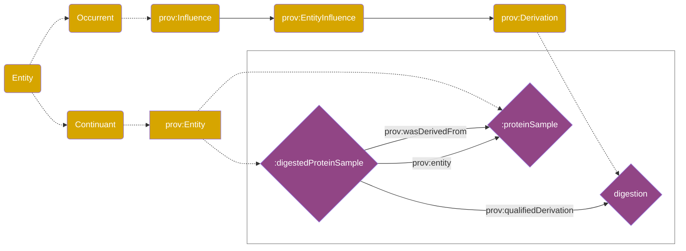
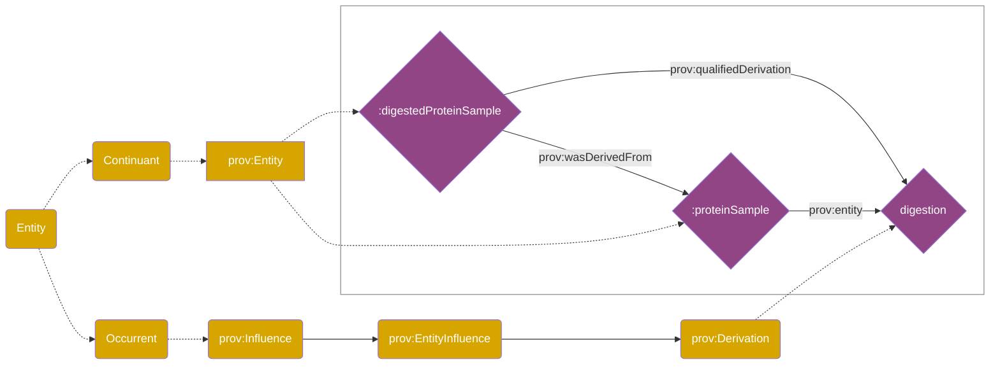

# Inconsistencies

```mermaid
graph LR

Entity(prov:Entity):::type --> |prov:entity| Influence(prov:Influence):::type

classDef type fill:#d6a500, color:white;
linkStyle default stroke:#0079c0
```

---

### Inconsistent

```mermaid

graph LR
    A(Entity):::type -.-> B(Continuant):::type
    A(Entity):::type -.-> C(Occurrent):::type    
    
    %%%%% PROV TERMS
    prov:Entity:::type
    Influence(prov:Influence):::type
    EntityInfluence(prov:EntityInfluence):::type
    Derivation(prov:Derivation):::type
    
    %%%%% RELATIONS
    B -.-> prov:Entity:::type
    C -.-> Influence
    Influence --> EntityInfluence
    EntityInfluence --> Derivation
    
    prov:Entity -.-> digestedProtein
    
    prov:Entity -.-> protein
    Derivation -.-> digestion
    

    _:::example
    subgraph _[ ]
        digestedProtein{:digestedProteinSample}:::instance
        protein{:proteinSample}:::instance
        digestion{digestion}:::instance

        digestedProtein ---> |prov:qualifiedDerivation| digestion
        digestedProtein --> |prov:wasDerivedFrom| protein

        digestedProtein --> |prov:entity| protein

    end


    classDef BFO fill:#F5AD27,color:#060606
    classDef instance fill:#914585, color: white;
    classDef example fill:white, stroke: gray;

    classDef type fill:#d6a500, color:white;
```
### Consistent

```mermaid

graph LR
    A(Entity):::type -.-> B(Continuant):::type
    A(Entity):::type -.-> C(Occurrent):::type    
    
    %%%%% PROV TERMS
    prov:Entity:::type
    Influence(prov:Influence):::type
    EntityInfluence(prov:EntityInfluence):::type
    Derivation(prov:Derivation):::type
    
    %%%%% RELATIONS
    B -.-> prov:Entity:::type
    C -.-> Influence
    Influence --> EntityInfluence
    EntityInfluence --> Derivation
    prov:Entity -.-> digestedProtein
    prov:Entity -.-> protein
    Derivation -.-> digestion

    _:::example
    subgraph _[ ]
        digestedProtein{:digestedProteinSample}:::instance
        protein{:proteinSample}:::instance
        digestion{digestion}:::instance

        digestedProtein ---> |prov:qualifiedDerivation| digestion
        digestedProtein --> |prov:wasDerivedFrom| protein

        protein --> |prov:entity| digestion
    end


    classDef BFO fill:#F5AD27,color:#060606
    classDef instance fill:#914585, color: white;
    classDef example fill:white, stroke: gray;

    classDef type fill:#d6a500, color:white;
```

